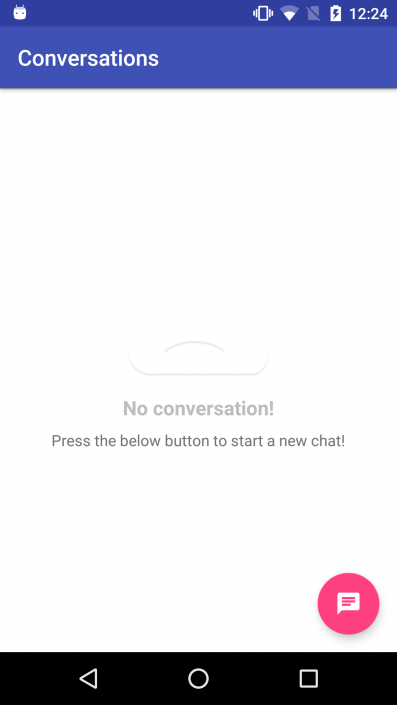

# Get Started for Android

## Introduction

With this tutorial you will learn how to create a fully functional chat as a Single View Application.

The full code of this tutorial is available on GitHub:

[DOWNLOAD SOURCE CODE](https://github.com/chat21/chat21-get-started-android)

## Prerequisites

Before you begin, you need a few things to set up in your environment:

* Android Studio 3.0.0 or later
* Android SDK Build-Tools 26.0.2 or later
*  A Firebase project correctly configured and the Chat21 Firebase cloud functions installed. Detailed instructions [here](https://github.com/chat21/chat21-cloud-functions)

## Firebase setup

### **Create a Firebase project**

Sign up on Firebase and create a project. Please refer directly to Firebase [https://firebase.google.com](https://firebase.google.com/) to accomplish and better understand this task. Chat21 relies on Firebase as the backend, so it's really important for you to acquire familiarity with Firebase and all of his services.

### Setup the backend for your project

After you successfully created a Firebase project you must **setup the backend**. Please follow this link to install [**Chat21 cloud functions**](https://github.com/chat21/chat21-cloud-functions) on your just created Firebase project.

## Configure authentication

Now with the setup of your Firebase project and backend functions installed you can enable email authentication to provide an easy way for your app to sign in with email and password.

Enable **email signin** in Firebase console:


Create a user to test chat functions:


Choose email and password:


Add the user with “ADD USER” button.

## Create Android Studio project

This tutorial will focus on the creation of a simple **single view application**. In the next tutorial you will approach the creation of a more realistic **multi tab application** \(similar to Whatsapp\).

First open Android Studio, select Start a new Android Studio Project and insert the project info using **MyChat** as project name and insert your team.

 **NOTE: Take note of the Package name, it will be used in the following steps**


Select the Phone and Tablet &gt; API Android 19: 4.4 \(Kitkat\) as minimum SDK

Select Empty Activity


Insert the Activity and the Layout name


## Create the Firebase Android App

Switch on the project on Firebase, go to the _Firebase Console_ &gt; _Project Overview_ and add a **Android App** to your project by clicking on “Add Android App” and follow the setup steps.

When prompted, enter your app’s Package name \(you have pinned previously\). It’s important to enter the Package name your app is using, this can only be set when you add an app to your Firebase project.

At the end, you’ll download a **google-services.json** file. You can download this file again at any time.

Now add this file to your Android project App root


## Add Firebase libs to the project

Now go back to your Android project and add firebase libraries to your project.

First, add rules to your **root-level** `build.gradle` file, to include the google-services plugin and the Google’s Maven repository:

```
buildscript {
    // ...
    dependencies {
        // ...
        classpath 'com.google.gms:google-services:4.2.0'
    }
}

allprojects {
    // ...
    repositories {
        // ...
        google()
    }
}
```

Then, in your **module** Gradle file \(usually the `app/build.gradle`\), add the `apply plugin` line at the bottom of the file to enable the Gradle plugin:

```
apply plugin: 'com.android.application'
// ...
dependencies {
    // ...
    implementation "com.google.android.gms:play-services:11.8.0"
}
// ... 
apply plugin: 'com.google.gms.google-services'
```

NOTE: the complete guide to add Firebase libs to you project is available here: [https://firebase.google.com/docs/android/setup](https://firebase.google.com/docs/android/setup)

## **Install Chat21 libraries**

Add the following to your `app/build.gradle` file:

```
defaultConfig {
// ...
multiDexEnabled true
}
dependencies {
// ...
implementation 'com.android.support:multidex:1.0.1'
implementation "com.google.android.gms:play-services:11.8.0"
implementation 'com.android.support:support-v4:28.0.0'
implementation 'com.android.support:design:28.0.0'
implementation 'org.chat21.android:chat21:1.0.15'
implementation 'com.vanniktech:emoji-ios:0.5.1'
implementation 'com.github.bumptech.glide:glide:3.7.0'
implementation 'com.daimajia.swipelayout:library:1.2.0@aar'
}
// ...
configurations.all {
    resolutionStrategy.eachDependency { DependencyResolveDetails details ->
        def requested = details.requested
        if (requested.group == 'com.android.support') {
            if (!requested.name.startsWith("multidex")) {
                details.useVersion '26.1.0'
            }
        }
    }
}
```

Create a custom Application class

```
public class AppContext extends Application {

@Override
protected void attachBaseContext(Context base) {
    super.attachBaseContext(base);
           MultiDex.install(this); // add this
    }
}
```

and add it to the Manifest.xml

```
<application
             android:name=".AppContext"
             android:icon="@mipmap/ic_launcher"
             android:label="@string/app_name"
             android:theme="@style/AppTheme"
             ...
</application> 
```

#### **Style**

Replace the default parent theme in your **styles.xml**

“Theme.AppCompat.Light.~~**DarkActionBar”**~~ with Theme.AppCompat.Light. **NoActionBar**

```
<style name="AppTheme" parent="Theme.AppCompat.Light.NoActionBar">
   <!-- Customize your theme here. -->
   <item name="colorPrimary">@color/colorPrimary</item>
   <item name="colorPrimaryDark">@color/colorPrimaryDark</item>
   <item name="colorAccent">@color/colorAccent</item>
</style> 
```

**Get start with the UI**

Add the following code to the **onCreate** method of your Main Activity and substitute variable in bracket using the previously created user’s email and password.
For **APP_ID** use "chat" (this is the tenant's name and MUST be the same for all of your Clients, ex. iOS)

```
FirebaseDatabase.getInstance().setPersistenceEnabled(true);

ChatManager.startWithEmailAndPassword(this, [APP_ID], 
  [YOUR_EMAIL], [YOUR_PASSWORD], new ChatAuthentication.OnChatLoginCallback() {
   @Override
   public void onChatLoginSuccess(IChatUser currentUser) {
      ChatManager.getInstance().createContactFor(currentUser.getId(), currentUser.getEmail(),
          [YOUR_FIRST_NAME], [YOUR_LAST_NAME], new OnContactCreatedCallback() {
              @Override
              public void onContactCreatedSuccess(ChatRuntimeException exception) {
                  if (exception == null) {
                      ChatUI.getInstance().openConversationsListActivity();
                  } else {
                      // TODO: handle the exception
                  }
              }
          });
   }
    
   @Override
   public void onChatLoginError(Exception e) {
          // TODO: 22/02/18
   }
});
```

Now **launch** the project.

If everything is correct you will see the conversations’ history with no conversations.



As you can see, in the **authWithEmail** completion block we use the _createContactFor_ method to create a contact on the remote backend for the currently signed user. In this way every user will add his metadata to contacts as soon as he sign in. The button on the bottom right corner open the contacts list.


You will see yourself listed. If you want you can chat with yourself but it’s better to create another user and sign in on a chat installed on another device \(or simulator instance\).

Happy chatting 🙂

Feel free to send feedbacks to [support@frontiere21.it](mailto:support@frontiere21.it)

