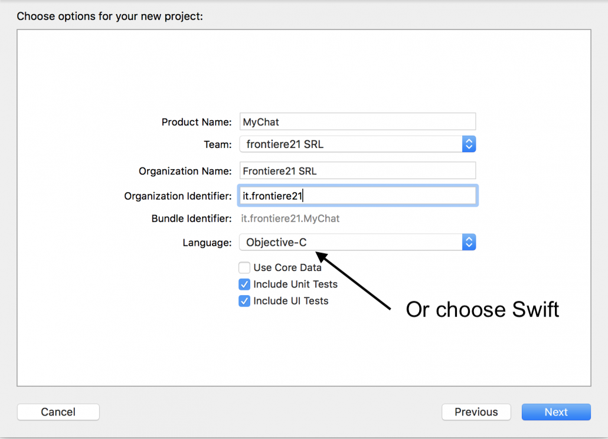

# Get Started for iOS

## Introduction

With this tutorial you will learn how to create a fully functional chat as a **Single View Application** in _Swift_ or _Objective-c_ using XCode.

The full code of this tutorial is available on GitHub:

[DOWNLOAD SWIFT SOURCE CODE](https://github.com/chat21/chat21-get-started-swift)

[DOWNLOAD OBJECTIVE-C SOURCE CODE](https://github.com/chat21/chat21-get-started-ios)

## Prerequisites

Before you begin, you first need to set up your environment:

1. Xcode 9.0 or later
2. An Xcode project targeting iOS 9 or above
3. The bundle identifier of your app

## Firebase setup

### **Create a Firebase project**

Sign up on Firebase and create a project. Please refer directly to Firebase [https://firebase.google.com](https://firebase.google.com/) to accomplish and better understand this task. Chat21 relies on Firebase as the backend, so it's really important for you to acquire familiarity with Firebase and all of his services.

### Setup the backend for your project

After you successfully created a Firebase project you must **setup the backend**. Please follow this link to install [**Chat21 cloud functions**](https://github.com/chat21/chat21-cloud-functions) on your just created Firebase project.

## Configure authentication

Now with the setup of your Firebase project and backend functions installed you can enable email authentication to provide an easy way for your app to sign in with email and password.

Enable **email signin** in Firebase console:


Create a user to test chat functions:


Choose email and password:


Add the user with “ADD USER” button.

## Create the Xcode project

This tutorial will focus on the creation of a simple **single view application**. In the next tutorial you will approach the creation of a more realistic **multi tab application** \(similar to Whatsapp\).

First open Xcode, select File &gt; New &gt; Project and choose Single View App:


Insert the project info using **MyChat** as project name and insert your team:  



## Create the Firebase iOS App

Switch on the project on Firebase, go to the _Firebase Console_ &gt; _Project Overview_ and add a **iOS App** to your project by clicking on “Add iOS App” and follow the setup steps.

When prompted, enter your app’s bundle ID. It’s important to enter the bundle ID your app is using, this can only be set when you add an app to your Firebase project.

At the end, you’ll download a **GoogleService-Info.plist** file. You can download this file again at any time.

Now add this file to your Xcode project root using the Add Files utility in Xcode \(from the File menu, click Add Files\). Make sure the file is included in your app’s build target.

## Add Chat21 SDK to the project

Chat21 uses CocoaPods so simply create a file named “Podfile” in the project’s root folder with the following content:

```text
platform :ios, '10.0'
use_frameworks!

target 'MyChat' do
  pod 'Chat21'
end

```

**Close Xcode** and run:

> **pod install**

From now on open the project using _MyChat.xcworkspace_ file.

## Get started with the UI

Open **AppDelegate.m** adding the following import directives:



```swift
import Firebase
import Chat21
```



```objectivec
#import "AppDelegate.h"
#import "ChatManager.h"
#import "ChatUIManager.h"
#import "ChatUser.h"
#import "ChatAuth.h"
@import Firebase;
```



Now configure Firebase and Chat frameworks. Edit the **didFinishLaunchingWithOptions** method, adding the following code:



```swift
FirebaseApp.configure()
ChatManager.configure()
let email = "YOUR EMAIL";
let password = "YOUR PASSWORD";
ChatAuth.auth(withEmail: email, password: password) { (user, error) in
    if let err = error {
        print("Authentication error: ", err.localizedDescription);
    }
    else {
        let chatm = ChatManager.getInstance()
        if let user = user {
            user.firstname = "YOUR FIRST NAME";
            user.lastname = "YOUR LAST NAME";
            chatm?.start(with: user)
            let conversationsVC = ChatUIManager.getInstance().getConversationsViewController()
            if let window = self.window {
                window.rootViewController = conversationsVC
            }
            chatm?.createContact(for: user, withCompletionBlock: { (error) in
                print("Contact successfully created.")
            })
        }
    }
}
return true
```



```objectivec
[FIRApp configure];
[ChatManager configure];

NSString *email = @"YOUR-EMAIL";
NSString *password = @"YOUR-PASSWORD";
[ChatAuth authWithEmail:email password:password completion:^(ChatUser *user, NSError *error) {
  if (error) {
    NSLog(@"Authentication error. %@", error);
  }
  else {
    ChatManager *chatm = [ChatManager getInstance];
    user.firstname = @"YOUR FIRST NAME";
    user.lastname = @"YOUR LAST NAME";
    [chatm startWithUser:user];
    UINavigationController *conversationsVC = [[ChatUIManager getInstance] getConversationsViewController];
    self.window.rootViewController = conversationsVC;
    [[ChatManager getInstance] createContactFor:user withCompletionBlock:nil];
  }
}];
```



Using the previously created user’s email and password, add this code to the **didFinishLaunchingWithOptions** method:

Now **launch** the project.

If everything is correct you will see the conversations’ history with no conversations.


As you can see, in the **authWithEmail** completion block we use the _createContactFor_ method to create a contact on the remote backend for the currently signed user. In this way every user will add his metadata to contacts as soon as he signs in. The button on the upper right corner opens the contacts list.


You will see yourself listed. If you want you can chat with yourself but it’s better to create another user and sign in on a chat installed on another device \(or simulator instance\).

Happy chatting 🙂

Feel free to send feedbacks to [support@frontiere21.it](mailto:support@frontiere21.it)

